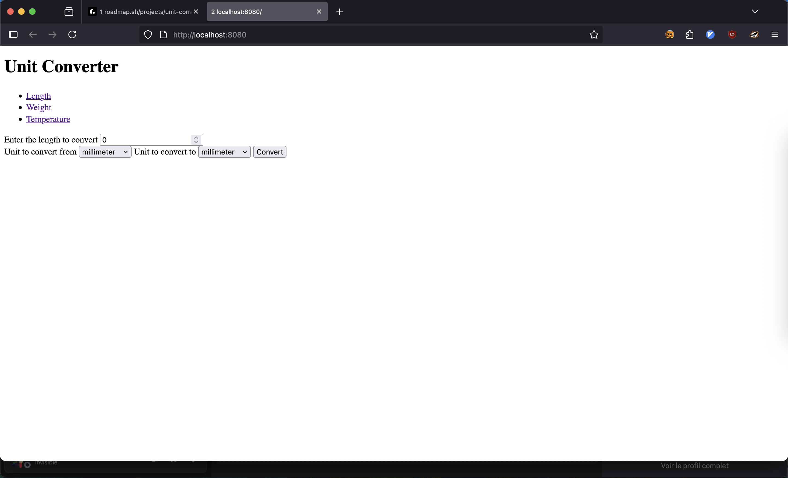

# [unit-converter](https://roadmap.sh/projects/unit-converter)

Unit converter to convert between different units of measurement

## Requirements

go installed

## installation

To install or run locally, clone the repo and make the script executable:

```bash
git clone https://github.com/macrespo42/unit-converter
cd unit-converter
go run .

```

## Usage

When the application is running you can access it at localhost:8080


